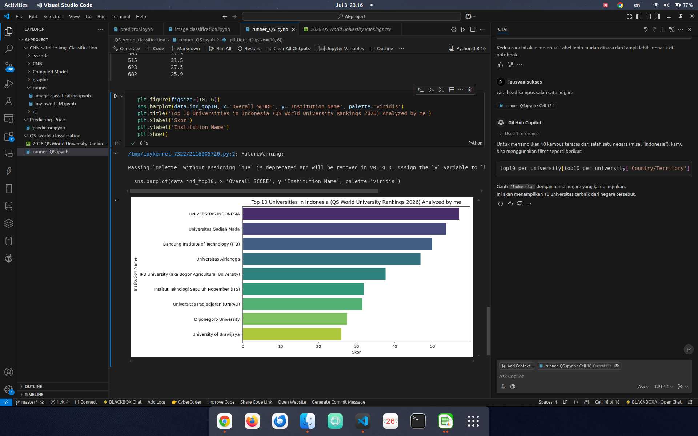
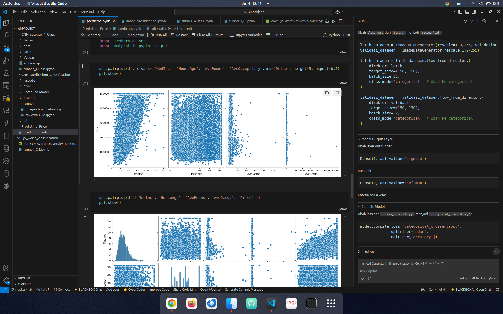

<h1 align="center">📌 Linear_Regression_BY el </h1>


<!-- Ganti ini dengan deskripsi singkat proyek -->
home price detection and QS world university rangking data analyst

---

## 📸 Demo

<!-- Tambahkan screenshot, GIF, atau video demo jika ada -->



---

## 🚀 Features

<!-- Daftar fitur utama dari proyek -->
- ✅ Predicting Home Price
- ✅ Tiddy up and clead the data
- ✅ Applying linear regression
- 🔧 Future Work / Planned Improvements

---

## 🧰 Tech Stack

<!-- Daftar bahasa dan tools yang digunakan -->
- Language: `Python`, ...
- Framework: `TensorFlow`, ...
- Hardware (if any): none

---

## 📂 Project Structure

```bash
your-project/
├── src/                  # Source code
├── models/               # Model files or weights
├── docs/                 # Documentation, images, references
├── requirements.txt      # Python dependencies
├── README.md             # Project description
└── LICENSE               # License file (MIT by default)
